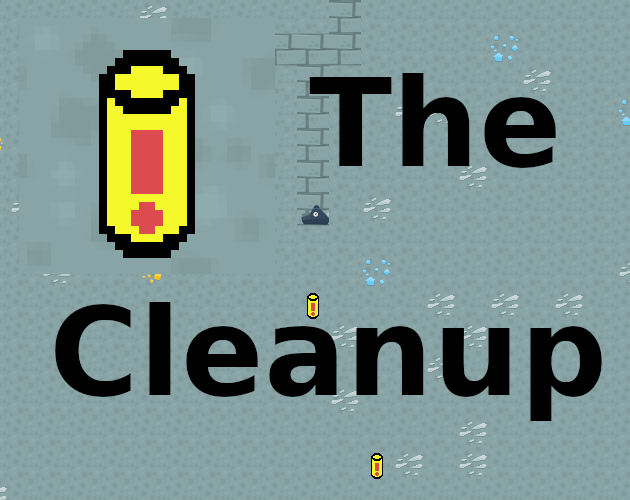

# The Cleanup

A game developed for `Mini Jam 76: Radiation` (Limitation: one handed controls)

You are a mining robot tasked with cleaning up old and forgotten radioactive waste. Dig your way through stone and minerals and cleanup. Don't forget to make some money on the way and refuel regularly!

**Controls**: WASD, Press S to drill the material below you, A/D for the material left/right of you

Builds for Windows, Linux and Mac can be found in the Releases or on [itch.io](https://niklme.itch.io/the-cleanup)

The game is written in Rust using the awesome Game engine [Bevy](https://github.com/bevyengine/bevy).

Assets are mostly by [Kenny](https://kenney.nl) ([CC0 1.0 Universal](https://creativecommons.org/publicdomain/zero/1.0/)). Thanks :heart:

Some other assets (like sounds) are by [Sirconplus](https://github.com/Sirconplus) and [me](https://nikl.me)
